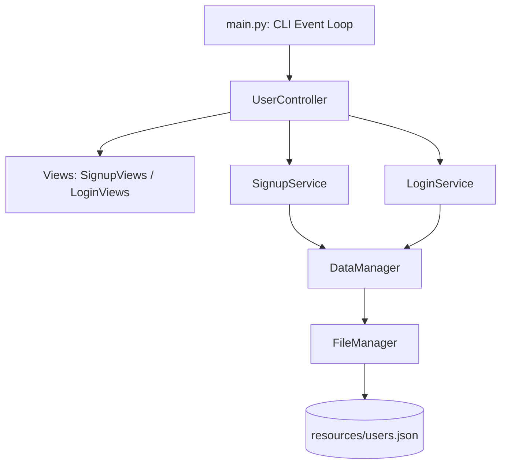

# 콘솔 기반 사용자 관리 시스템 (CMS) 아키텍처 및 상세 명세

## 1. 프로젝트 개요 (Overview)

- **프로젝트명**: Console-based User Management System (CMS)
- **개발 환경**: Python 3.10+
- **데이터 저장소**: JSON 파일 시스템 (`Portfolio/CMS/resources/users.json`)
- **설계 목적**: 
  - 계층화 아키텍처(Layered Architecture) 및 관심사의 분리(Separation of Concerns)를 실무 수준으로 구현
  - 의존성 주입(Dependency Injection, DI) 패턴을 활용한 느슨한 결합 구조 확립
  - 일관된 표준 응답 객체(`status`, `code`, `data`) 기반의 에러 핸들링 및 데이터 흐름 설계
  - CLI 환경에서의 사용자 인증(회원가입, 로그인, 세션 관리, 로그아웃) 및 데이터 영속화 실습

---

## 2. 디렉터리 및 패키지 구조 (Directory Structure)

```text
Portfolio/CMS/
├── main.py                     # 애플리케이션 진입점 및 전역 CLI 이벤트 루프
├── config/                     # 공통 설정 및 상수 정의 패키지
│   ├── __init__.py             # 패키지 export 인터페이스
│   ├── constants.py            # 응답 상태(STATUS) 및 시스템 코드(CODE)
│   └── defaultData.py          # 저장소 초기화용 기본 데이터 템플릿
├── controllers/                # 사용자 입력 제어 및 흐름 중계 레이어
│   ├── __init__.py             # 패키지 export 인터페이스
│   └── user_controller.py      # 회원가입/로그인/세션 총괄 컨트롤러
├── services/                   # 비즈니스 로직 및 도메인 규칙 레이어
│   ├── __init__.py             # 패키지 export 인터페이스
│   └── user/
│       ├── __init__.py
│       ├── signup_service.py   # 회원가입 입력값 유효성 검증 및 생성 로직
│       └── login_service.py    # 회원 인증 및 민감정보 마스킹 로직
├── managers/                   # 데이터 저장소 및 파일 시스템 접근 레이어
│   ├── __init__.py             # 패키지 export 인터페이스
│   ├── data_manager.py         # 인메모리/컬렉션 단위 CRUD 및 Auto ID 채번
│   └── file_manager.py         # JSON 파일 단위 저수준 I/O 및 예외 처리
├── views/                      # 콘솔 화면 출력 및 UI 포맷팅 레이어
│   ├── __init__.py             # 패키지 export 인터페이스
│   └── user/
│       ├── __init__.py
│       ├── signup_views.py     # 회원가입 성공/에러 화면 뷰
│       └── login_views.py      # 로그인 성공/에러 화면 뷰
└── resources/                  # 데이터 파일 저장 경로
    └── users.json              # 영속화된 사용자 데이터셋 (UTF-8 JSON)
```

---

## 3. 시스템 아키텍처 및 계층별 역할 (Layered Architecture)

CMS는 명확하게 분리된 5개의 계층으로 구성되어 있습니다.



### 3.1 계층별 상세 역할

1. **Presentation / CLI Layer (`main.py`, `views/`)**
   - `main.py`: 로그인 상태(`userController.isLoggedIn()`)에 따라 조건부 메뉴(로그인 전: 회원가입/로그인/종료, 로그인 후: 환영 메시지/로그아웃/종료)를 제공하고 무한 루프를 통해 애플리케이션을 구동합니다.
   - `views/`: 비즈니스 로직과 분리되어 CLI 터미널 출력 서식(가운데 정렬, 구분선, 에러 목록 출력 등)만 전담합니다.

2. **Controller Layer (`controllers/user_controller.py`)**
   - 사용자 입력(`input()`)을 받아 정형화된 데이터 딕셔너리로 구성합니다.
   - 적절한 서비스(`SignupService`, `LoginService`)에 검증 및 처리를 위임합니다.
   - 처리 결과에 따라 뷰(`SignupViews`, `LoginViews`)를 호출하고, 로그인 성공 시 현재 사용자 세션(`currentUser`)을 관리합니다.

3. **Business Logic Layer (`services/user/`)**
   - **`SignupService`**:
     - 필수 입력 필드(`uid`, `username`, `email`, `password`) 누락 여부 검증
     - 상세 검증: UID 최소 길이(3자 이상) 및 중복 검사(`store.findBy`), 이메일 포맷(`@`, `.`), 비밀번호 최소 길이(8자 이상), 이름 길이(3자 이상)
     - 검증 실패 시 다중 에러 리스트 반환
   - **`LoginService`**:
     - UID 기반 사용자 검색 및 비밀번호 일치 확인
     - 로그인 성공 시 보안을 위해 데이터 객체에서 비밀번호(`password`) 필드를 삭제(`del`)한 안전한 사용자 정보 반환

4. **Data Access / Persistence Layer (`managers/`)**
   - **`DataManager`**:
     - 컬렉션 단위의 공통 인터페이스 제공: `findAll()`, `findBy()`, `create()`, `update()`, `delete()`
     - 정수형 식별자(`id`) 자동 채번(`generateId`): 기존 ID 중 최댓값 + 1 할당
     - 파일 미존재 시 `DEFAULT_DATA` 기반으로 자동 복구 및 저장
   - **`FileManager`**:
     - OS 경로 처리(`basePath` + `resources/{key}.json`)
     - UTF-8 인코딩 및 들여쓰기(`indent=4`)를 적용한 안전한 JSON 읽기/쓰기
     - `FileNotFoundError`, `JSONDecodeError`를 포착하여 시스템 에러 코드로 반환

5. **Configuration Layer (`config/`)**
   - `STATUS`: 응답 결과 플래그 (`'success'`, `'error'`)
   - `CODE`: `DATA_SAVED`, `DATA_FETCHED`, `DUPLICATE_DATA`, `INVALID_UID`, `INVALID_PASSWORD`, `FAILED_LOGIN` 등 시스템 전반에서 공유하는 표준화된 응답 코드 정의

---

## 4. 데이터 흐름 및 핵심 시나리오 (Data Flow)

### 4.1 회원가입 처리 흐름 (Signup Flow)

1. 사용자가 메뉴에서 `1. Signup` 선택
2. `UserController.signup()` 실행: `uid`, `username`, `email`, `password` 입력 및 현재 Unix 타임스탬프(`createdAt`, `updatedAt`) 추가
3. `SignupService.validate()` 호출:
   - 각 필드별 전용 검증 메서드(`validateUid`, `validateEmail` 등) 실행
   - `DataManager.findBy('users', 'uid', value)`를 통한 아이디 중복 체크
4. **검증 실패 시**: 에러 목록(`errors`)을 `SignupViews.display_error()`로 전달하여 위반된 필드와 사유 출력
5. **검증 성공 시**: `SignupService.create()` 호출 -> `DataManager.create()`에서 신규 `id` 발급 후 `FileManager.write()`를 통해 `users.json`에 영속화 -> `SignupViews.display_success()` 출력

### 4.2 로그인 및 세션 관리 흐름 (Login & Session Flow)

1. 사용자가 `2. Login` 선택 후 아이디/비밀번호 입력
2. `LoginService.login()` 호출:
   - `DataManager.findBy('users', 'uid', uid)`로 사용자 레코드 탐색
   - 레코드가 없거나 비밀번호가 일치하지 않으면 `FAILED_LOGIN` 코드 반환
3. 인증 통과 시 비밀번호 필드를 제거한 순수 프로필 데이터 반환
4. `UserController`는 전달받은 유저 정보를 `self.currentUser`에 저장 (인메모리 세션 확립)
5. `main.py`의 메인 루프에서 `isLoggedIn()`이 `True`가 되며 개인화된 환영 메시지 및 회원 전용 메뉴(`afterLoginMenu`)로 자동 전환

---

## 5. 실행 및 테스트 방법 (How to Run)

### 5.1 실행 명령어

터미널에서 `Portfolio/CMS` 디렉터리로 이동 후 진입점을 실행합니다.

```bash
# 디렉터리 이동
cd "Portfolio/CMS"

# 애플리케이션 실행
python main.py
```

### 5.2 주요 테스트 케이스

| 시나리오 | 입력값 예시 | 기대 결과 |
| :--- | :--- | :--- |
| **필수값 누락** | UID에 공백 입력 | `MISSING_REQUIRED_DATA` 에러 목록 출력 |
| **UID 최소 길이 미달** | UID: `ab` (2글자) | `INVALID_UID` 에러 출력 |
| **비밀번호 규칙 위반** | Password: `1234` (4글자) | `INVALID_PASSWORD` 에러 출력 (8자 이상 요구) |
| **이메일 형식 오류** | Email: `testdomain.com` (`@` 누락) | `INVALID_EMAIL` 에러 출력 |
| **정상 회원가입** | UID: `admin`, PW: `password123`, Email: `admin@test.com` | `User created successfully` 출력 및 JSON 영속화 |
| **아이디 중복 검증** | 기존에 존재하는 `admin`으로 재가입 시도 | `DUPLICATE_DATA` 에러 출력 |
| **로그인 성공** | 등록된 `admin` / `password123` 입력 | 로그인 성공, `Welcome, {name}` 출력, 메뉴 변경 |
| **로그아웃** | 로그인 상태에서 `1. Logout` 선택 | 세션 초기화 후 로그인 전 메뉴 복귀 |

---

## 6. 아키텍처적 특장점 및 확장성 (Strengths & Extensibility)

1. **단일 책임 원칙 (SRP) 준수**:
   - 화면 출력(`views`), 도메인 규칙 검증(`services`), 데이터 흐름 제어(`controllers`), 파일 I/O(`managers`)가 완전히 분리되어 코드 수정 시 상호 영향이 최소화됩니다.
2. **표준화된 응답 포맷**:
   - 모든 비즈니스 로직과 데이터 관리 레이어가 `{ 'status': ..., 'code': ..., 'data': ... }` 규격을 준수하므로 에러 추적과 디버깅이 직관적입니다.
3. **손쉬운 저장소 교체 (Extensibility)**:
   - `DataManager`가 비즈니스 로직과 파일 시스템(`FileManager`) 사이의 완충 역할을 수행하므로, 향후 SQLite, MySQL 등의 관계형 DB나 NoSQL로 저장소를 변경할 때 서비스 레이어의 코드 수정 없이 `DataManager` 구현부만 교체할 수 있습니다.
